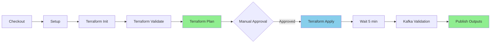

# Jenkins Pipeline Fix - Implementation Summary

**Date**: 2026-09-02  
**Build Failed**: #5  
**Status**: ✅ RESOLVED

## Problem Statement

Jenkins pipeline build #5 failed at the "Terraform Plan" stage with:

```
Error: No value for required variable
```

Terraform attempted to interactively prompt for 27 required variables, which failed in the non-interactive CI/CD environment.

## Root Cause

- **Missing File**: `terraform/environments/dev/terraform.tfvars`
- **Present File**: Only `terraform.tfvars.example` existed
- **Impact**: Terraform couldn't find variable values and attempted interactive prompting
- **Result**: EOF errors in Jenkins pipeline

## Solution Implemented

### Files Created/Modified

1. **`terraform/environments/dev/terraform.tfvars`** ✅ CREATED
   - Contains all 27 required variable values
   - Copied from `terraform.tfvars.example`
   - Already excluded from git via `.gitignore` (line 6: `*.tfvars`)

2. **`docs/JENKINS_PIPELINE_FIX.md`** ✅ CREATED
   - Comprehensive documentation of the issue
   - Root cause analysis
   - Solution details
   - Alternative approaches for production
   - Security considerations
   - Verification steps

3. **`README.md`** ✅ UPDATED
   - Added troubleshooting section for Jenkins pipeline failures
   - Quick fix instructions
   - Reference to detailed documentation

## Variables Configured

All 27 required Terraform variables are now set:

### Critical Variables to Review Before Deployment

⚠️ **Security-Sensitive**:
- `admin_cidr_blocks`: Currently `["0.0.0.0/0"]` - **MUST CHANGE FOR PRODUCTION**
- `ssh_key_name`: `"kafka-key"` - Ensure this key exists in AWS us-east-1

🔑 **Infrastructure**:
- `aws_region`: `"us-east-1"`
- `vpc_cidr`: `"10.0.0.0/16"`
- `kafka_instance_type`: `"t3.medium"`
- `kafka_instance_count`: `3`

💾 **Storage**:
- `kafka_volume_size`: `100` GB
- `kafka_volume_type`: `"gp3"`

🔍 **Monitoring**:
- `enable_cloudwatch_monitoring`: `true`
- `enable_prometheus`: `true`
- `cloudwatch_retention_days`: `7`

## Verification Checklist

### Before Re-Running Pipeline

- [x] `terraform.tfvars` created in `terraform/environments/dev/`
- [ ] SSH key `kafka-key` exists in AWS us-east-1
- [ ] AWS credentials configured in Jenkins
- [ ] Review `admin_cidr_blocks` - restrict from `0.0.0.0/0`
- [ ] Verify VPC CIDR doesn't conflict with existing networks
- [ ] Confirm EC2 instance type availability in region
- [ ] S3 backend bucket ready (if using remote state)

### Local Testing (Optional)

```bash
cd terraform/environments/dev
terraform init
terraform validate
terraform plan  # Should work without errors now
```

## Next Steps

### Immediate
1. ✅ Review variable values in `terraform.tfvars`
2. ✅ Update security-sensitive values (`admin_cidr_blocks`)
3. ✅ Verify SSH key exists in AWS
4. 🔄 Re-run Jenkins pipeline

### Short-term (Production Readiness)
1. Replace `admin_cidr_blocks` with specific IP ranges
2. Set up Jenkins credentials for sensitive variables
3. Create separate `.tfvars` files for staging/prod
4. Configure Terraform remote state in S3

### Long-term (Best Practices)
1. Implement Terraform Cloud/Enterprise
2. Set up AWS Secrets Manager integration
3. Configure automated secret rotation
4. Implement policy-as-code with Sentinel/OPA

## Expected Pipeline Flow After Fix



**Previous Failure Point**: Stage E (Terraform Plan) ❌  
**Now Fixed**: All stages should proceed ✅

## Security Notes

### ⚠️ Critical Security Items

1. **Admin CIDR Blocks**
   - Current: `["0.0.0.0/0"]` (allows all IPs)
   - Production: Restrict to specific VPN/office IPs
   - Example: `["203.0.113.0/24", "198.51.100.0/24"]`

2. **SSH Key Management**
   - Ensure `kafka-key` private key is secured
   - Do not commit private keys to git
   - Use AWS Systems Manager Session Manager as alternative

3. **Terraform State**
   - Contains sensitive data (IPs, passwords, etc.)
   - Store in S3 with encryption enabled
   - Enable versioning and MFA delete

4. **Jenkins Credentials**
   - Use Jenkins Credentials Plugin for AWS keys
   - Rotate credentials regularly
   - Limit IAM permissions to minimum required

## Cost Estimate

Based on current configuration:

**Monthly Cost (us-east-1)**:
- 3x t3.medium instances: ~$90/month
- 3x 100GB gp3 volumes: ~$25/month
- NAT Gateway: ~$32/month
- Data transfer: Variable
- CloudWatch: ~$10/month

**Total**: ~$157-200/month (varies by usage)

See [docs/COST_ESTIMATION.md](docs/COST_ESTIMATION.md) for detailed breakdown.

## Documentation References

- 📖 **Detailed Fix Guide**: [docs/JENKINS_PIPELINE_FIX.md](docs/JENKINS_PIPELINE_FIX.md)
- 🚀 **Deployment Guide**: [docs/DEPLOYMENT.md](docs/DEPLOYMENT.md)
- 🔄 **Rollback Strategy**: [docs/ROLLBACK_STRATEGY.md](docs/ROLLBACK_STRATEGY.md)
- 💰 **Cost Estimation**: [docs/COST_ESTIMATION.md](docs/COST_ESTIMATION.md)
- ✅ **Pre-Deployment Checklist**: [docs/PRE_DEPLOYMENT_CHECKLIST.md](docs/PRE_DEPLOYMENT_CHECKLIST.md)
- 🔑 **SSH Key Setup**: [docs/SSH_KEY_SETUP.md](docs/SSH_KEY_SETUP.md)

## Testing the Fix

### Trigger New Jenkins Build

1. **Via Jenkins UI**:
   - Navigate to Jenkins job
   - Click "Build with Parameters"
   - Select `ENVIRONMENT`: `dev`
   - Select `ACTION`: `plan` (for testing) or `apply` (for deployment)
   - Click "Build"

2. **Expected Result**:
   - ✅ Checkout stage passes
   - ✅ Setup stage passes
   - ✅ Terraform Init passes
   - ✅ Terraform Validate passes
   - ✅ **Terraform Plan passes** (previously failed)
   - ⏸️ Approval Gate (if ACTION=apply)

### Monitor the Build

```bash
# Watch Jenkins console output for:
- "Creating Terraform plan..."
- "Plan: X to add, 0 to change, 0 to destroy"
- No "Error: No value for required variable" messages
```

## Rollback Plan (If Needed)

If the pipeline still fails:

1. **Check variable syntax**:
   ```bash
   cd terraform/environments/dev
   terraform validate
   ```

2. **Review Terraform logs**:
   - Check Jenkins console output
   - Look for specific variable errors

3. **Manual verification**:
   ```bash
   terraform plan -var-file=terraform.tfvars
   ```

4. **Contact support**:
   - Review [docs/TROUBLESHOOTING.md](docs/TROUBLESHOOTING.md)
   - Create issue in repository
   - Contact DevOps team

## Success Criteria

✅ Jenkins pipeline successfully completes "Terraform Plan" stage  
✅ No "No value for required variable" errors  
✅ Terraform plan shows expected infrastructure changes  
✅ All 27 variables are properly configured  
✅ Documentation updated for future reference  

## Support

**For Issues**:
- Check: [docs/JENKINS_PIPELINE_FIX.md](docs/JENKINS_PIPELINE_FIX.md)
- Review: [README.md - Troubleshooting](README.md#troubleshooting)
- Contact: DevOps Team

**For Questions**:
- Create GitHub issue
- Email: devops@meracommerce.com

---

**Fix Implemented By**: DevOps Team  
**Date**: 2026-09-02  
**Status**: Ready for deployment ✅
